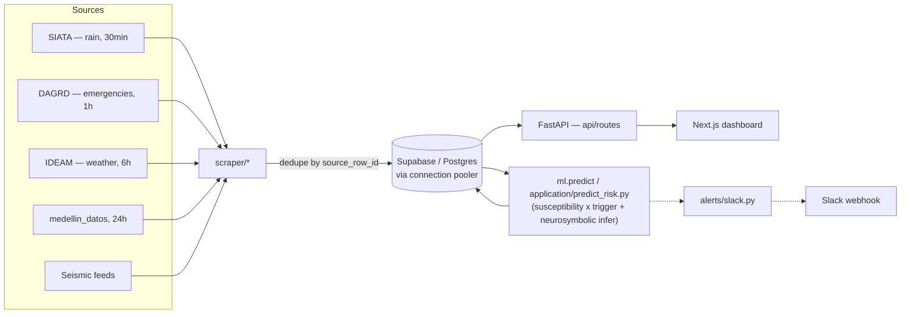
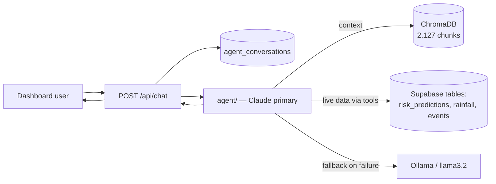

# Architecture

TEYVA is a landslide-risk monitoring platform for Medellín (19 comunas + corregimientos):
real-time ingestion, 7-day ML prediction, REST API, and a web dashboard with conversational AI
and Slack alerts.

## Folder tree

```
teyva/
├── platform/
│   ├── backend/          # SINGLE Python package (PYTHONPATH points here)
│   │   ├── domain/       # PURE rules (no I/O): risk_rules.py (thresholds, categories,
│   │   │                 #   compute_alert_state) + communes.py (SINGLE source of territory)
│   │   ├── application/  # Use cases: predict_risk.py, fire_alerts.py, train_model.py
│   │   ├── infrastructure/
│   │   │   ├── repositories/  # Shared queries (latest prediction per commune, etc.)
│   │   │   └── external/      # HTTP/SDK clients: arcgis, slack, osrm, llm
│   │   ├── ml/           # ML engine: train.py, predict.py (inference), benchmark.py, models/
│   │   ├── scraper/      # siata (30min), dagrd (1h), ideam (6h), medellin_datos (24h), seismic
│   │   │   └── scheduler.py  # APScheduler daemon + health watchdog (Slack alert)
│   │   ├── db/           # SQLAlchemy async+sync, session.py, 12+ tables
│   │   ├── api/          # FastAPI: routes/ + auth.py (roles) + rate_limit.py + audit.py
│   │   ├── agent/        # Chat: Claude (primary) + Ollama (fallback), RAG, MCP
│   │   ├── rag/          # ChromaDB + sentence-transformers (2,127 chunks)
│   │   ├── alerts/       # Slack alert construction + Snake Line + evacuation
│   │   ├── constants.py  # ONLY operational config: cooldowns, scraper intervals
│   │   └── alembic/      # migrations (7+)
│   └── frontend/         # Next.js 16 + React 19 + Tailwind 4 + Radix/shadcn
│       ├── components/dashboard/  # map, KPIs, chat, history, rain monitor, health
│       └── lib/api.ts    # centralized fetch client
├── specs/                # Spec-driven development: one dir per spec (spec/plan/tasks)
├── .github/workflows/    # 6 crons: 5 scrapers + predict-risk (run alembic + write to Supabase)
└── docker-compose.yml    # local stack: db (fallback), ollama, backend, frontend, scraper, ml
```

**Layers** (dependency direction `api/scraper → application → domain/infrastructure`):
`domain/` imports nothing with I/O and owns the single definition of the territory
(`domain/communes.py`). Alert composition (which checks run after ingestion/prediction/periodic)
lives only in `application/fire_alerts.py`. Entrypoints invoked by GitHub Actions
(`python -m scraper.siata`, `python -m ml.predict`, `python -m ml.train`) are thin wrappers that
delegate to `application/` and do not move.

## Data flow — ingestion, ML, API, dashboard



## Chat + RAG flow



`LLM_PROVIDER=anthropic` (default `claude-haiku-4-5`) with automatic fallback to Ollama. Both
share the prompt and the 5 tools in `agent/rag_tools.py`. RAG is gated by `ENABLE_RAG=true` and
returns automatic source citations via contextvars.

See `docs/api.md` for endpoints, `docs/data-schema.md` for tables, and root `CLAUDE.md` for the
full architecture narrative (source of truth for this document).
